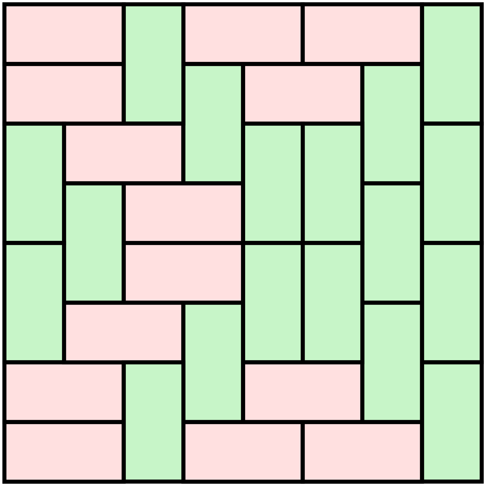

# Ricopertura di una griglia mxn tramite domini 1x2

Ecco una ricopertura (tiling) di una griglia 8x8 (come una scacchiera):

Quindi la griglia 8x8 ammette un tiling con tessere del domino.

Assegnati due numeri naturali m ed n, il tuo programma deve stabilire se la griglia mxn ammetta anche essa un tiling con tessere del domino.

Riesci a costruire tale tiling disponendo le tessere una ad una?

goal 1: decidere, 1 <= m = 1, n <= 20
goal 2: decidere,  1 <= m, n <= 20
goal 3: costruire, 1 <= m = 1, n <= 20
goal 4: costruire,  1 <= m, n <= 20
